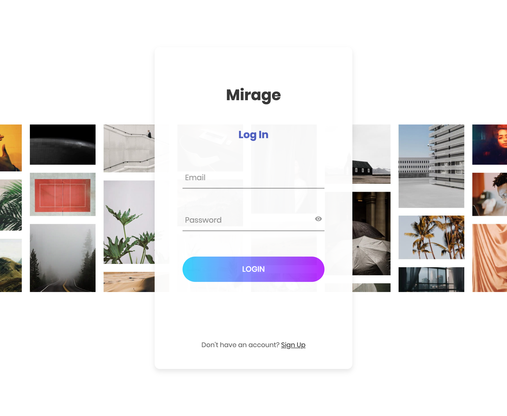

# Mirage - The new social platform - Project 2

  
  
  ## Description
  Mirage is an elegant solution that allows users to create and share posts online.
  
  ## Table of Contents
  - [Description](#description)
  - [Installation](#installation)
  - [Usage](#usage)
  - [Screenshot](#screenshot)
  - [Link](#link)
  - [License](#license)
  - [Contributing](#contributing)
  - [Questions](#questions)
  
  ## Installation
  Mirage has been deployed using heroku.

  ## Screenshot
  
  
  ## Link
  Application is deployed using heroku and can be access at https://polar-forest-94137.herokuapp.com/
  
  ## Usage
  Mirage is used for sharing images with friends for comment
  
  ## License
  
  
   
  This application is covered under the MIT license.

  ## Contributing
  Contact developers if you with to contribute

  ## Questions
  Contact developers if you find any issues with the application
  

